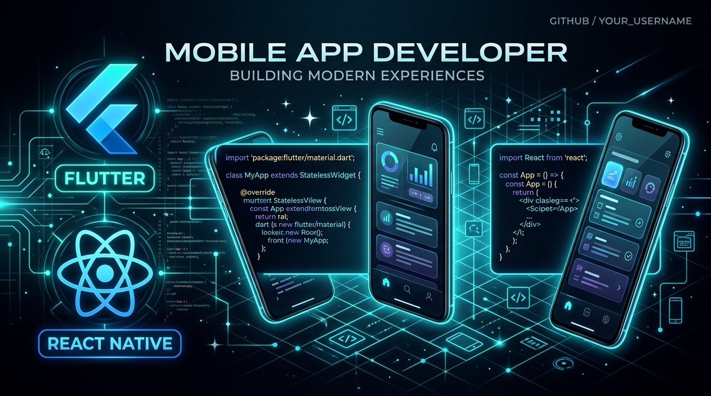
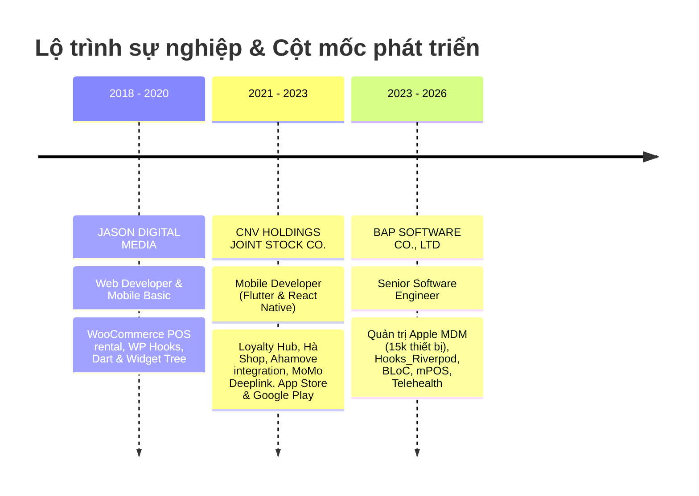
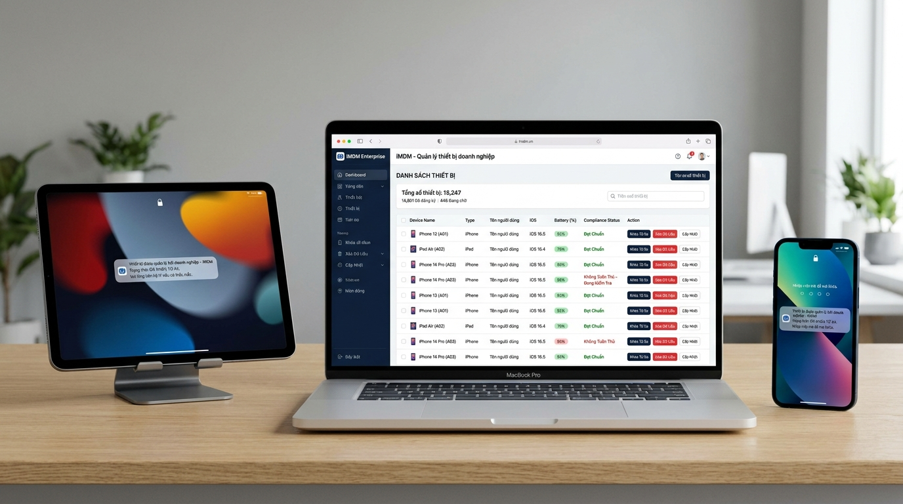
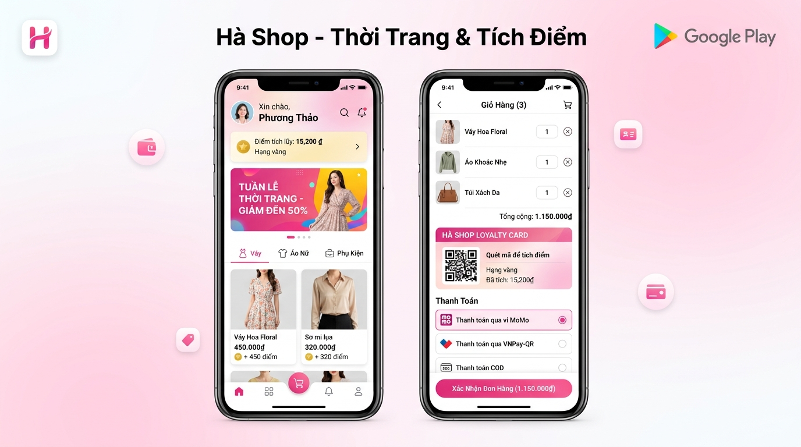
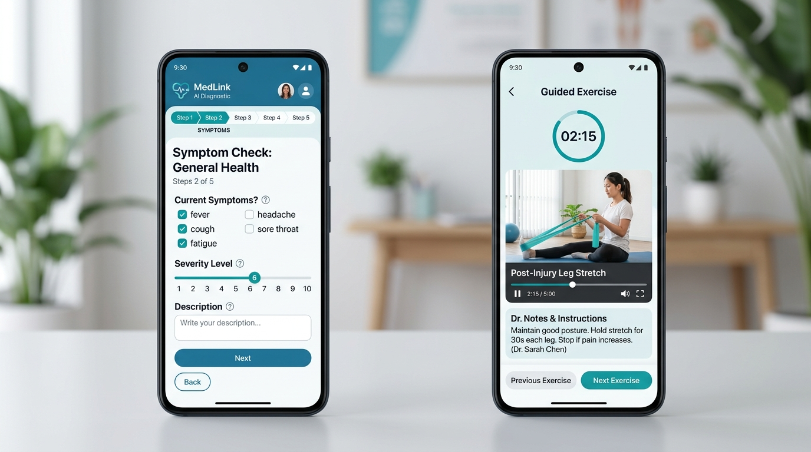
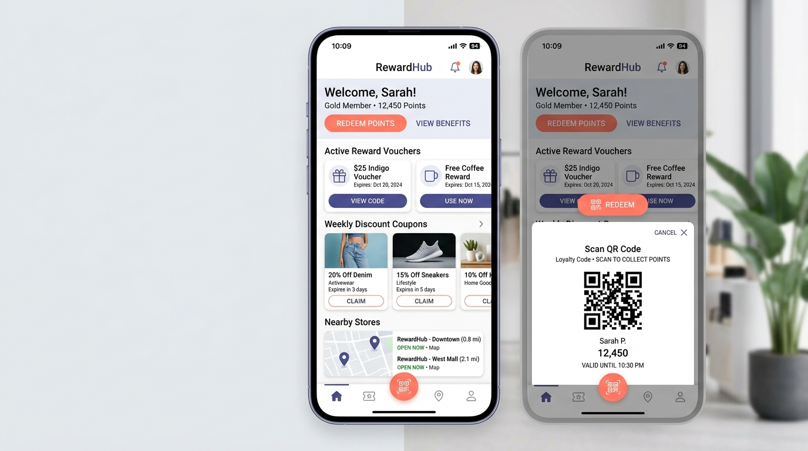
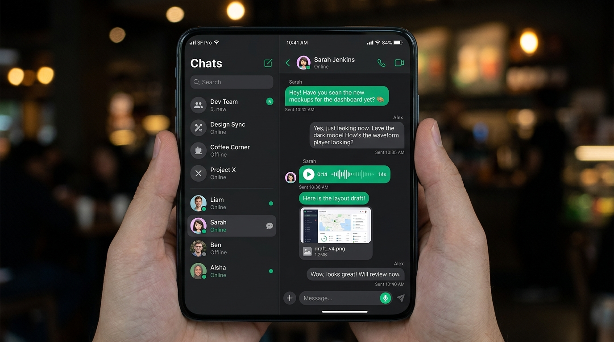
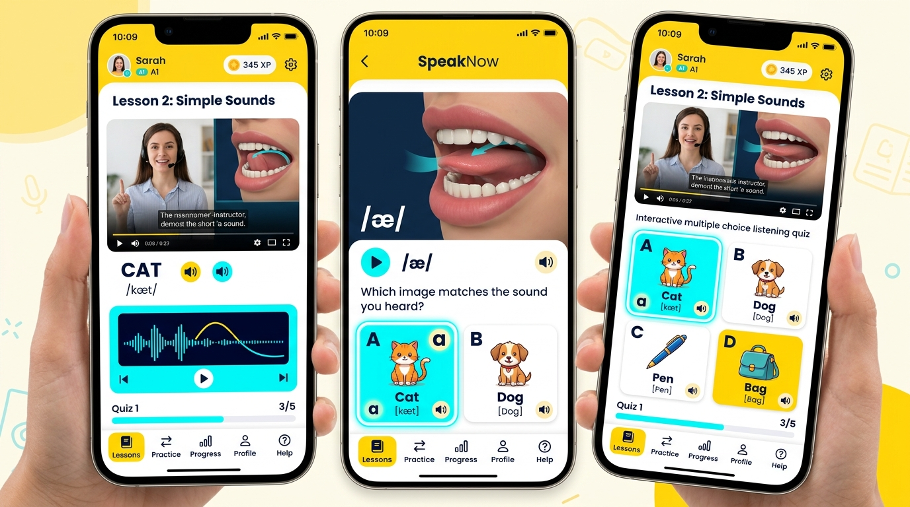
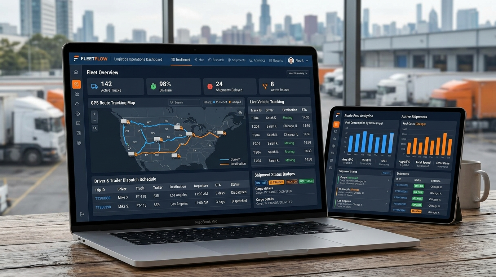

# 🚀 NGUYỄN THÀNH NGUYÊN
### **Senior Software Engineer**
*Specializing in High-Performance Mobile Applications, Enterprise Apple Fleet Systems (MDM) & Cross-Platform Architectures*

 

 

  
  
  

---

## 🛠 Kỹ Năng Kỹ Thuật (Technical Skills)

  

 

| Lĩnh vực | Công nghệ & Công cụ chính |
|:---|:---|
| **Enterprise Fleet & MDM** | **Apple MDM Protocol**, **Apple Business Manager (ABM)**, **Automated Device Enrollment (ADE/DEP)**, **VPP (Volume Purchase)**, **APNs Push Service**, **Declarative Device Management (DDM)**, Configuration Profiles, Fleet Security (FileVault, Remote Wipe, Lost Mode) |
| **Mobile Engineering** | **Flutter**, **React Native**, Dart Core, Widget Tree, Custom Painters, React Hooks, Redux Toolkit, Kotlin Basic |
| **Web & Landing Pages** | WordPress Core, Elementor Pro, Blocksy, WooCommerce Hooks, Responsive Web Design, SEO & Performance |
| **State & Architecture** | **Hooks Riverpod**, **BLoC / Cubit**, **GetX**, **Provider**, **Clean Architecture**, **MVVM**, **MVP** |
| **Cloud & Backend APIs** | **Firebase** (Auth, Cloud Firestore, Realtime DB, FCM, Crashlytics), **RESTful API**, WebSockets, PHP, MySQL |
| **Payment & Logistics** | **mPOS Hardware SDK**, **MoMo Deeplink**, **VNPay**, **Ahamove On-Demand Delivery API** |
| **Developer Tools** | Git (GitFlow), GitHub, GitLab, VS Code, Android Studio, Xcode, Postman, Figma |

---

## 💼 Kinh Nghiệm Làm Việc (Work Experience)

### 1. 🏢 **BAP SOFTWARE CO., LTD**
> **Senior Software Engineer** *(04/2023 – 2026)*
- Thiết kế giải pháp kỹ thuật, phân tích kiến trúc hệ thống và dẫn dắt phát triển các dự án trọng điểm.
- Thiết kế, tích hợp và vận hành hệ thống **Apple MDM quản lý đội tàu hơn 15.000 thiết bị Apple** (MacBook, iPhone, iPad), tự động hóa Onboarding Zero-touch (ABM/ADE), phân phối ứng dụng VPP và giám sát tuân thủ bảo mật thời gian thực chuẩn Enterprise.
- Phát triển ứng dụng di động lớn với **Flutter** áp dụng **Hooks_Riverpod** và **BLoC**, đảm bảo khả năng chịu tải và mở rộng.
- Tích hợp giải pháp thanh toán thiết bị phần cứng **mPOS**, đảm bảo tính toàn vẹn và bảo mật giao dịch tài chính.
- R&D các công nghệ mới, hướng dẫn thành viên và chuẩn hóa quy trình phát triển trong team.

### 2. 🏢 **CNV HOLDINGS JOINT STOCK COMPANY**
> **Mobile Developer** *(05/2021 – 03/2023)*
- Phát triển và duy trì hệ sinh thái ứng dụng chăm sóc khách hàng thân thiết (**Loyalty Apps**, **Loyalty HUB**, **Hà Shop**).
- Tích hợp thanh toán di động qua **MoMo Deeplink**, **VNPay** và hệ thống giao hàng tức thời **Ahamove**.
- Xử lý hệ thống thông báo đẩy (Push Notifications), phân tích dữ liệu, biểu đồ thống kê tăng trưởng khách hàng.
- Trực tiếp cấu hình chứng chỉ, ký số và phát hành hàng loạt ứng dụng lên **Apple App Store** và **Google Play Store**.

### 3. 🏢 **JASON DIGITAL MEDIA SERVICES TRADING CO., LTD**
> **Web & Mobile Developer** *(12/2018 – 12/2020)*
- Lập trình chức năng cho thuê và điểm bán hàng (POS rental) tùy chỉnh cho WooCommerce / WordPress.
- Xây dựng các plugin mở rộng tùy chỉnh sử dụng WordPress Hooks, Actions, Filters và RESTful API.
- Nghiên cứu nền tảng Flutter (Dart Core, Widget Tree) và phát triển nền tảng di động cơ bản với Kotlin.
- Tối ưu hóa tốc độ tải trang, debug và tối ưu hiệu suất ứng dụng.

---

## 📱 Dự Án Tiêu Biểu (Featured Projects)

Dưới đây là 11 dự án tiêu biểu được Nguyễn Thành Nguyên tham gia trực tiếp phát triển:

---

### 1. 🍎 **Quản Lý Hệ Thống Apple MDM (15.000 Thiết Bị Doanh Nghiệp)**
> **Thời gian:** 2023 – 2026 &nbsp;|&nbsp; **Quy mô:** 15.000+ Thiết bị Apple &nbsp;|&nbsp; **Vai trò:** Senior Software Engineer

- **Mô tả:** Hệ thống quản trị và kiểm soát thiết bị di động tập trung (Mobile Device Management) chuẩn doanh nghiệp, quản lý vận hành toàn bộ vòng đời của hơn 15.000 thiết bị Apple (macOS, iOS, iPadOS) phân tán trên diện rộng.
- **Tính năng & Giải pháp kỹ thuật nổi bật:**
  - **Zero-Touch Onboarding:** Tích hợp sâu với **Apple Business Manager (ABM)** và **Automated Device Enrollment (ADE/DEP)**, cho phép thiết bị khi mở hộp tự động đăng ký vào hệ thống quản lý, cấu hình Wi-Fi bảo mật và phân quyền mà không cần IT can thiệp thủ công.
  - **Volume Purchase Program (VPP):** Tự động phân bổ, cài đặt ngầm (silent install), thu hồi và tái cấp phát hàng ngàn bản quyền phần mềm doanh nghiệp qua Apps & Books.
  - **Giám sát & Thực thi Tuân thủ (Security Compliance):** Áp dụng cấu hình bắt buộc: mã hóa ổ đĩa FileVault (macOS), chính sách mật khẩu phức tạp, tường lửa (Firewall), hạn chế camera/AirDrop khi cần.
  - **Điều khiển & Khắc phục từ xa qua APNs:** Tận dụng Apple Push Notification service (APNs) để gửi lệnh khóa từ xa (Remote Lock), xóa sạch dữ liệu bảo mật (Remote Wipe), kích hoạt chế độ thất lạc (Lost Mode) và đẩy bản vá hệ điều hành (OS Patch Enforcement).
  - **Declarative Device Management (DDM):** Giảm tải lưu lượng server, thiết bị tự động chủ động báo cáo trạng thái vi phạm chính sách theo thời gian thực.
- **Tech Stack:** `Apple MDM Protocol` `Apple Business Manager (ABM)` `ADE/DEP` `VPP` `APNs Push Engine` `DDM` `PKI Certificates` `RESTful Cloud API`

---

### 2. 🏫 **Landing Page Mầm Non Montessori Learn N Play**
> **Thời gian:** 2023 &nbsp;|&nbsp; **Lĩnh vực:** Giáo dục Quốc tế &nbsp;|&nbsp; **Vai trò:** Web / Frontend Developer  
> 🔗 **Website:** [https://learnnplay.vn/](https://learnnplay.vn/)

- **Mô tả:** Landing Page chuẩn quốc tế giới thiệu Hệ thống Trường Mầm Non Montessori Learn N Play (cho trẻ từ 12 tháng – 6 tuổi). Thiết kế UI/UX thân thiện, tươi sáng, tối ưu trải nghiệm phụ huynh và tỷ lệ chuyển đổi đăng ký tư vấn tuyển sinh & tham quan trường.
- **Tính năng & Giải pháp kỹ thuật nổi bật:**
  - Thiết kế Responsive 100% chuẩn Pixel-Perfect trên mọi thiết bị di động, tablet và desktop.
  - Giới thiệu trực quan 5 lĩnh vực học tập Montessori, không gian lớp học và hệ thống giáo cụ tiêu chuẩn quốc tế.
  - Tích hợp biểu mẫu đăng ký nhận học bổng & đặt lịch tham quan trường trực tuyến gửi thông báo tức thời.
  - Tối ưu hóa tốc độ tải trang (PageSpeed), cấu trúc SEO On-page và tích hợp đo lường tiếp thị số.
- **Tech Stack:** `WordPress` `Elementor Pro` `Blocksy Theme` `PHP` `Responsive CSS3` `SEO & Performance`

---

### 3. 💳 **POS APP / Loyalty HUB (Merchant & Store Operations)**
> **Thời gian:** 12/2021 – 06/2022 &nbsp;|&nbsp; **Ngôn ngữ:** Flutter &nbsp;|&nbsp; **Quy mô nhóm:** 3 người  
> 🔗 **Google Play:** [https://play.google.com/store/apps/details?id=vn.cnv.cnvloyalty.nethub&hl=en](https://play.google.com/store/apps/details?id=vn.cnv.cnvloyalty.nethub&hl=en)

- **Mô tả:** Ứng dụng quản trị và vận hành dành cho chủ cửa hàng và nhân viên trong hệ sinh thái khách hàng thân thiết CNV Loyalty.
- **Tính năng nổi bật:**
  - Quét mã QR/Barcode siêu tốc để tích điểm, trừ điểm và áp dụng mã khuyến mãi cho khách hàng.
  - Quản lý đơn hàng, đặt chỗ (booking) và nhận thông báo đẩy tức thì (Push Notification).
  - Tích hợp dịch vụ gọi xe giao hàng tự động thông qua API **Ahamove**.
  - Hiển thị biểu đồ thống kê doanh thu, lưu lượng khách hàng trực quan theo ngày/tuần/tháng.
- **Tech Stack:** `Flutter` `Provider` `QR Code Scanner` `Ahamove API` `Firebase FCM` `Syncfusion Charts`

---

### 4. 🛍 **Loyalty App - Hà Shop (Retail & Spa E-Commerce)**
> **Thời gian:** 05/2021 – 03/2022 &nbsp;|&nbsp; **Ngôn ngữ:** Flutter &nbsp;|&nbsp; **Quy mô nhóm:** 3 người  
> 🔗 **Google Play:** [https://play.google.com/store/apps/details?id=vn.cnv.cnvloyalty.hashop&hl=en](https://play.google.com/store/apps/details?id=vn.cnv.cnvloyalty.hashop&hl=en)

- **Mô tả:** Ứng dụng chăm sóc khách hàng thân thiết và thương mại điện tử chuyên sâu cho các doanh nghiệp thời trang, bán lẻ và dịch vụ làm đẹp/spa.
- **Tính năng nổi bật:**
  - Đăng nhập bảo mật qua Google, Apple ID và Firebase OTP SMS.
  - Thẻ thành viên VIP điện tử với cơ chế tích lũy điểm thưởng và nâng hạng hạng mức.
  - Tích hợp giỏ hàng thanh toán liền mạch qua cổng **MoMo** và **VNPay**.
  - Đặt lịch hẹn trải nghiệm dịch vụ spa với giao diện chọn ngày giờ linh hoạt.
  - Hoàn thiện quy trình build và phát hành trên App Store & Google Play.
- **Tech Stack:** `Flutter` `GetX / Provider` `MoMo Deeplink` `VNPay` `RESTful API` `Firebase Auth`

---

### 5. 🏥 **Business Application (Telehealth & Medical Survey)**
> **Thời gian:** 04/2023 – 07/2023 &nbsp;|&nbsp; **Ngôn ngữ:** Flutter &nbsp;|&nbsp; **Quy mô nhóm:** 8 người

- **Mô tả:** Ứng dụng chẩn đoán bệnh từ xa thông qua bộ câu hỏi khảo sát phân nhánh thông minh và hệ thống video bài tập phục hồi chức năng có sẵn.
- **Tính năng nổi bật:**
  - Đăng nhập đa kênh: Google Sign-In, Apple ID, Firebase Authentication.
  - Tích hợp cổng thanh toán trực tuyến: **MoMo**, **VNPay**.
  - Đặt lịch hẹn khám bệnh trực tuyến (Booking) và đặt đơn thuốc/dịch vụ (Order).
  - Trình quản lý giao diện động (Dynamic UI manager) tùy biến theo từng chuyên khoa và ngành nghề.
  - Tối ưu hóa và phát hành thành công trên **App Store** và **Google Play**.
- **Tech Stack:** `Flutter` `Dart` `Hooks Riverpod` `Firebase Auth` `MoMo SDK` `VNPay` `RESTful API`

---

### 6. 🏃‍♂️ **WellNess (AI Camera Fitness & Pose Analysis)**
> **Thời gian:** 12/2022 – 04/2023 &nbsp;|&nbsp; **Ngôn ngữ:** Flutter &nbsp;|&nbsp; **Quy mô nhóm:** 2 người

- **Mô tả:** Ứng dụng theo dõi sức khỏe và chẩn đoán tình trạng thể chất thông qua trí tuệ nhân tạo và camera điện thoại.
- **Tính năng nổi bật:**
  - Nhận diện và phát hiện người dùng đứng trước camera để tự động kích hoạt phiên tập luyện.
  - Ghi hình video buổi tập và phát âm thanh hướng dẫn động tác theo nhịp điệu (Audio waveform guide).
  - Bộ câu hỏi chẩn đoán sức khỏe thông minh đưa ra lộ trình tập luyện cá nhân hóa.
  - Tối ưu hóa xử lý luồng camera theo thời gian thực mà không làm giảm tốc độ khung hình.
- **Tech Stack:** `Flutter` `Camera Streams` `BLoC` `Video Player` `Audio Engine` `RESTful API`

---

### 7. 🎯 **Loyalty App (Cross-Platform Retail & Booking)**
> **Thời gian:** 01/2021 – 05/2021 &nbsp;|&nbsp; **Ngôn ngữ:** React Native &nbsp;|&nbsp; **Quy mô nhóm:** 3 người

- **Mô tả:** Phiên bản ứng dụng khách hàng thân thiết đa nền tảng cho các thương hiệu ngành F&B, thời trang và thẩm mỹ viện.
- **Tính năng nổi bật:**
  - Xây dựng giao diện chuẩn Pixel-Perfect từ thiết kế Figma/XD.
  - Danh mục voucher giảm giá, mã giảm giá điện tử (E-vouchers) có thời hạn sử dụng.
  - Tích hợp cổng thanh toán trực tuyến MoMo và VNPay SDK cho React Native.
  - Quản lý đơn hàng và trạng thái đặt dịch vụ theo thời gian thực.
- **Tech Stack:** `React Native` `TypeScript` `Redux` `MoMo Bridge` `RESTful API` `FCM`

---

### 8. 💬 **Real-time Chat App (Messaging & Channels)**
> **Thời gian:** 10/2020 – 12/2020 &nbsp;|&nbsp; **Ngôn ngữ:** React Native &nbsp;|&nbsp; **Quy mô nhóm:** 1 người (Độc lập phát triển)

- **Mô tả:** Ứng dụng nhắn tin tức thời bảo mật, hỗ trợ nhắn tin cá nhân và tạo phòng chat hội nhóm.
- **Tính năng nổi bật:**
  - Xác thực người dùng (Đăng ký, Đăng nhập, Quên mật khẩu) thông qua **Firebase Authentication**.
  - Nhắn tin thời gian thực với độ trễ thấp sử dụng **Firebase Cloud Firestore / Realtime Database**.
  - Quản lý hồ sơ cá nhân, trạng thái online/offline và thời gian hoạt động gần nhất.
  - Tính năng phòng trò chuyện nhóm (Group Chat Rooms) và chia sẻ tệp tin/hình ảnh.
- **Tech Stack:** `React Native` `JavaScript` `Firebase Auth` `Cloud Firestore` `AsyncStorage`

---

### 9. 🎓 **English Learning App (Interactive Pronunciation & Quiz)**
> **Thời gian:** 08/2020 – 10/2020 &nbsp;|&nbsp; **Ngôn ngữ:** Flutter &nbsp;|&nbsp; **Quy mô nhóm:** 3 người

- **Mô tả:** Ứng dụng hỗ trợ học phát âm tiếng Anh trực quan bằng video khẩu hình miệng kết hợp bài kiểm tra trắc nghiệm hình ảnh.
- **Tính năng nổi bật:**
  - Trình phát video chuyên dụng hướng dẫn chi tiết cách đặt lưỡi và cử động môi cho từng âm vị IPA.
  - Xử lý video trực tiếp tại máy người dùng (Client-side video processing), tối ưu dung lượng bộ nhớ đệm.
  - Bài kiểm tra nghe âm thanh và chọn hình ảnh phản xạ tương ứng giúp ghi nhớ từ vựng hiệu quả.
  - Hệ thống điểm thưởng và huy hiệu học tập tạo động lực mỗi ngày.
- **Tech Stack:** `Flutter` `Dart` `Custom Video Player` `Audio Cache` `Stateful Widget Tree`

---

### 10. 🚚 **Quốc Huy Logistics (Transportation & Fleet ERP)**
> **Thời gian:** 03/2020 – 07/2020 &nbsp;|&nbsp; **Ngôn ngữ:** PHP / WordPress &nbsp;|&nbsp; **Quy mô nhóm:** 6 người

- **Mô tả:** Nền tảng web quản trị vận tải quy mô lớn cho doanh nghiệp logistic: điều phối đoàn xe container, tài xế, tối ưu hành trình và kế toán kho vận.
- **Tính năng nổi bật:**
  - Phân quyền người dùng đa cấp: Quản trị viên, Quản lý đội xe, Tài xế, Phụ xe.
  - Quản lý chi tiết danh mục phương tiện: số hiệu đầu kéo, rơ-moóc, hạn kiểm định và nhật ký sửa chữa.
  - Tạo đơn vận tải, tối ưu hóa cung đường di chuyển và theo dõi vị trí xe.
  - Quản lý kho hàng, xuất hóa đơn cước vận tải và báo cáo doanh thu chi phí tự động.
  - Tích hợp trao đổi dữ liệu với hệ thống quản lý kho WMS (Warehouse Management System).
- **Tech Stack:** `PHP` `WordPress Core` `MySQL` `RESTful API` `WMS Integration` `jQuery / CSS3`

---

### 11. 👗 **Ấn Tượng Đẹp (Costume & Product Rental Platform)**
> **Thời gian:** 01/2020 – 03/2020 &nbsp;|&nbsp; **Ngôn ngữ:** PHP / WordPress &nbsp;|&nbsp; **Quy mô nhóm:** 3 người

- **Mô tả:** Website thương mại điện tử chuyên biệt hỗ trợ mua sắm và cho thuê trang phục biểu diễn, đạo cụ sự kiện.
- **Tính năng nổi bật:**
  - Chức năng thuê sản phẩm theo khoảng ngày (Date-picker rental duration) tích hợp kiểm tra số lượng tồn kho theo lịch.
  - Tự động tính toán tiền đặt cọc (Deposit calculation) và chi phí phát sinh khi quá hạn trả đồ.
  - Quản lý vòng đời sản phẩm cho thuê: Đang giữ chỗ, Đã xuất kho, Đang thuê, Đã hoàn trả & Kiểm tra hư tổn.
  - Tích hợp đơn vị vận chuyển giao nhận hàng hai chiều tận nơi.
- **Tech Stack:** `PHP` `WooCommerce Hooks` `Rental Custom Plugin` `Payment Gateways` `Shipping API`

---

## 📊 GitHub Analytics & Metrics

  
  

  

---

## 📬 Liên Hệ & Kết Nối (Contact & Connect)

| Kênh liên hệ | Thông tin chi tiết |
|:---|:---|
| 📧 **Email** | [nguyenlaai10@gmail.com](mailto:nguyenlaai10@gmail.com) |
| 📱 **Điện thoại** | **0783 419 483** (Zalo / Call) |
| 📍 **Địa chỉ** | 239 Hòa Bình, P. Hiệp Tân, Q. Tân Phú, TP. Hồ Chí Minh |
| 🎓 **Trường học** | Đại học Cần Thơ (Can Tho University) |
| 💼 **Trạng thái** | Sẵn sàng cho cơ hội Senior Software Engineer (Full-time & Project) |

 

 

**© 2026 Nguyễn Thành Nguyên. Built with passion for robust enterprise systems & high-performance software.**

